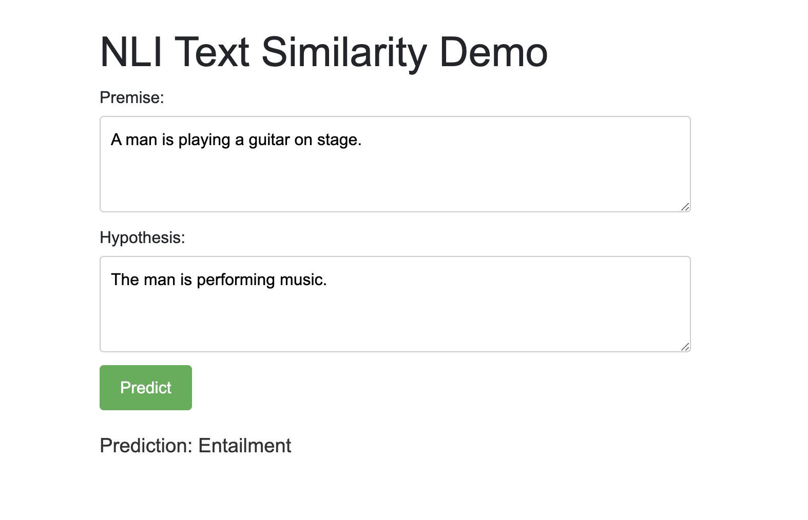

# Text Similarity Web App with Sentence-BERT

This repository demonstrates a simple Flask web application that leverages a custom-trained Sentence-BERT model—pretrained using BERT—to perform Natural Language Inference (NLI) for text similarity. The web app provides a user-friendly interface where users can input two sentences (a premise and a hypothesis) and receive a prediction indicating whether the relationship between them is Entailment, Neutral, or Contradiction.



## Dataset For BERT Model: [BookCorpus](https://huggingface.co/datasets/bookcorpus/bookcorpus)

### Description

The BookCorpus dataset is a collection of over 11,000 books written by unpublished authors. It is widely used for training language models due to its diverse and extensive text data. The dataset is available in the Hugging Face datasets library, making it easy to load and use.

## Model Details

Base Architecture: BERT (Bidirectional Encoder Representations from Transformers)  
Pretraining: The Sentence-BERT model was pretrained on an NLI task using [SNLI datasets](https://huggingface.co/datasets/stanfordnlp/snli).  
Customizations:  
Vocabulary size: Custom 60,305 tokens compared to the standard BERT vocabulary.  
Maximum position embeddings: Extended to 1000 positions to accommodate longer sequences.  
Fine-tuned on NLI task with three labels: Entailment, Neutral, and Contradiction.  
Classifier Head: A custom classifier head takes the concatenation of the mean-pooled embeddings of the premise and hypothesis, along with their absolute difference, and outputs logits for the three classes.

## Evaluation

The S-BERT model was trained and evaluated on a natural language inference (NLI) task using the SNLI dataset. The evaluation results indicate that the model's performance is suboptimal, with a validation accuracy of 29%.

### Key Metrics

Validation Accuracy: 0.2900 (29%)

Classification Report:

- Precision: 0.10 (macro avg), 0.08 (weighted avg)
- Recall: 0.33 (macro avg), 0.29 (weighted avg)
- F1-Score: 0.15 (macro avg), 0.13 (weighted avg)

|               | precision | recall | f1-score | support |
| ------ | ------ | ------ | ------ | ------ |
| Entailment    | 0.00      | 0.00   | 0.00     | 33      |
| Contradiction | 0.00      | 0.00   | 0.00     | 38      |

| accuracy      | 0.29      | 1.00   | 0.45     | 29      |
| macro avg     | 0.10      | 0.33   | 0.15     | 100     |
| weighted avg  | 0.08      | 0.29   | 0.13     | 100     |

Confusion Matrix:  
[[0  0 33]  
[ 0  0 38]  
[ 0  0 29]]

### Limitations and Challenges

From the results we can tell that the model only predicts one class, it indicates a significant issue with the model's training or the model's architecture or the dataset.

- Dataset Size
  The dataset used for training and evaluation was limited to 1,000 samples for training and 100 samples for testing. This small dataset size may not be sufficient for the model to learn meaningful patterns.
- Hyperparameter Tuning
  The model may not have been trained with optimal hyperparameters (e.g., learning rate, batch size, number of epochs), leading to poor performance.

## Conclusion

The current model performs poorly on the NLI task, possibly due to dataset limitations, and suboptimal training strategies. By implementing the proposed improvements, such as increasing dataset size, fine-tuning pre-trained models, and addressing class imbalance, the model's performance can be significantly enhanced.


### Citation

Book Corpus Dataset

```python
@article{zhu2015aligning,
  title={Aligning books and movies: Towards story-like visual explanations by watching movies and reading books},
  author={Zhu, Yukun and Kiros, Ryan and Zemel, Rich and Salakhutdinov, Ruslan and Torralba, Antonio and Urtasun, Raquel and Fidler, Sanja},
  journal={arXiv preprint arXiv:1506.06724},
  year={2015}
}
```

SNLI Dataset

```python
@InProceedings{Zhu_2015_ICCV,
    title = {Aligning Books and Movies: Towards Story-Like Visual Explanations by Watching Movies and Reading Books},
    author = {Zhu, Yukun and Kiros, Ryan and Zemel, Rich and Salakhutdinov, Ruslan and Urtasun, Raquel and Torralba, Antonio and Fidler, Sanja},
    booktitle = {The IEEE International Conference on Computer Vision (ICCV)},
    month = {December},
    year = {2015}
}
```
