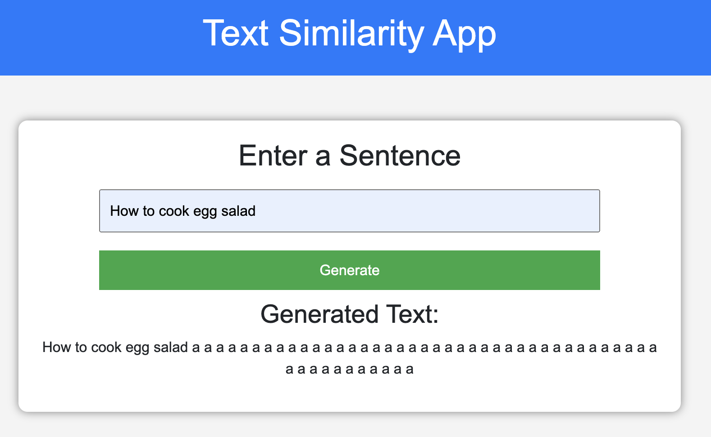

# Text Similarity App

This repository demonstrates a simple Flask web application that allows users to generate similar words or phrases based on a given input sentence using a pre-trained language model. Simply enter a sentence, and the app will generate related text using AI.



## Dataset For DPO Model: [Tulu3](https://huggingface.co/datasets/allenai/tulu-3-pref-personas-instruction-following?row=1)

### Description

This dataset contains 19890 preference examples and is synthetically created to enhance models' precise instruction following capabilities while satisfying several constraints. The dataset containts preference pairs (chosen, reject responses) and can be used for preference tuning methods (e.g., PPO, DPO).

### Sample Data

```python
# Sample Data
{'prompt': 'I would like to design an educational program for young learners at the community center that introduces them to the basics of anthropology in an engaging way. The program should include interactive activities and multimedia resources. Could you provide guidance on how to structure such a program, with at least 2 **key elements** highlighted? The response should be between 100 and 150 words, and please avoid using the words "lecture" and "textbook."',
 'chosen': 'To design an engaging anthropology program for young learners, focus on two key elements: interactive storytelling and hands-on activities. Begin with interactive storytelling sessions where children can explore different cultures through stories and legends. Use multimedia resources like videos and animations to bring these stories to life, making them relatable and exciting. \n\nFor hands-on activities, create cultural artifact workshops where children can craft simple replicas of historical tools or art using clay or other materials. This tactile experience helps them connect with ancient peoples\' daily lives. Additionally, organize a "cultural fair" where each session focuses on a different region\'s music, food, and traditions, encouraging students to participate in dances or prepare simple traditional dishes. Combining these elements will ensure the program is not only educational but also memorable and fun.',
 'rejected': 'Designing an educational program to introduce young learners to anthropology can be both exciting and enriching. Here\'s a structured approach to create an engaging program:\n\n1. **Theme-Based Modules**: Organize the curriculum into thematic modules such as "Discovering Cultures," "Human Evolution," "Traditions and Rituals," and "Languages and Communication." This thematic approach will help maintain focus and provide variety.\n\n2. **Interactive Workshops**: Begin each module with a hands-on workshop. For instance, in "Human Evolution," children could create their own timeline of human development using clay models. In "Discovering Cultures," they could participate in a role-playing activity where they simulate a day in the life of a child from another culture.\n\n3. **Storytelling Sessions**: Use storytelling to convey anthropological concepts. Share myths, legends, and tales from diverse cultures to highlight the importance of oral traditions. Invite storytellers or use audio-visual aids to make these sessions more immersive.\n\n4. **Multimedia Presentations**: Integrate videos, animations, and documentaries tailored for young audiences. Topics like ancient civilizations or the diversity of languages can be visually captivating and can help reinforce learning.\n\n5. **Cultural Art and Craft**: Incorporate art and craft sessions where children can recreate traditional art forms or make cultural artifacts. This could include making masks, weaving simple patterns, or designing henna tattoos, which can foster creativity and appreciation for cultural diversity.\n\n6. **Field Trips and Virtual Tours**: Organize visits to local museums or cultural sites. If physical trips are not feasible, use virtual reality experiences or online museum tours to explore historical sites and artifacts.\n\n7. **Interactive Games**: Develop simple games that teach anthropological concepts. For example, a matching game with global artifacts and their origins, or a scavenger hunt for finding cultural symbols around the community center.\n\n8. **Guest Speakers and Cultural Exchanges**: Invite anthropologists or community members from diverse backgrounds to share their experiences and insights. This can be a great way for children to ask questions and engage with real-world perspectives.\n\n9. **Reflection and Sharing Circles**: End each module with a discussion circle where learners share what they found most interesting or surprising. Encourage them to express their thoughts through drawings, short presentations, or group projects.\n\n10. **Resource Library**: Create a resource corner with engaging materials such as picture books, documentaries, and cultural artifacts that children can explore at their own pace during free time.\n\nBy combining these elements, the program will not only educate but also inspire curiosity and respect for the rich tapestry of human culture and history.'}
```

### Preprocessing

- Loads the dataset and removes unnecessary columns.
- Splits the data into training and test sets (80/20 split).
- Formats the dataset into a dictionary with prompt, chosen, and rejected responses.
- Applies a sanity check to limit data size for debugging if needed.

## Model Details

Base Architecture: [DPO](https://huggingface.co/docs/trl/main/en/dpo_trainer#trl.DPOConfig) (Direct Preference Optimization)  
is a method introduced by Hugging Face's trl library for training language models using preference data. Unlike traditional reinforcement learning from human feedback (RLHF), DPO simplifies the process by directly optimizing the model to align with human preferences without requiring a separate reward model or complex reinforcement learning pipelines.

Then this base is finetuned using Tulu3 data and push to [HuggingFace](https://huggingface.co/Voravit-124874/my_dpo_model)

## Experiment with hyperparameters and report training performance

Fine-tuning language models involves experimenting with various hyperparameters to achieve optimal performance. Based on the parameters you've provided, here are some interesting and impactful parameters you can tune to improve your model's performance:

- Learning Rate (learning_rate)
  Why it matters: The learning rate controls how quickly the model updates its weights during training. Too high, and the model may fail to converge; too low, and training may be slow or get stuck in local minima.  
   Range: 1e-2, 1e-3, 1e-4

  | Learning Rate |                   |
  | ------------- | ----------------- |
  | 1e-2          | 7.367437248706818 |
  | 1e-3          | 9.859145460426808 |
  | 1e-4          | 9.903306308865547 |

- Batch Size (per_device_train_batch_size, per_device_eval_batch_size)
  Why it matters: Batch size affects the stability and speed of training. Larger batch sizes can improve convergence but require more memory.  
   Range: 1, 4

  | Batch Size |                    |
  | ---------- | ------------------ |
  | 1          | 18.651448460576926 |
  | 4          | 9.859145460426808  |

<!-- - Gradient Accumulation Steps (gradient_accumulation_steps)
    Why it matters: This allows you to simulate a larger batch size by accumulating gradients over multiple steps before updating the model.
    Range: 2, 4, 8 -->

- Beta (beta)
  Why it matters: In Direct Preference Optimization (DPO), beta controls the strength of the preference loss. A higher beta emphasizes preference alignment, while a lower beta allows more exploration.  
   Range: 0.05, 0.1, or 0.2

  | Batch Size |                   |
  | ---------- | ----------------- |
  | 0.05       | 11.18867048432103 |
  | 0.1        | 4.526151014950263 |
  | 0.2        | 9.044402436228689 |

So the best parameters setting here would be: [Learning Rate: 1e-2, Batch Size:4, Beta:0.1]

### Citation

This code is provided and derived from the work of Prof.Chaklam Silpasuwanchai and Mr.Todsavad Tangtortan on [Github](https://github.com/chaklam-silpasuwanchai/Python-fo-Natural-Language-Processing/blob/main/Code/07%20-%20Human%20Preferences/huggingface/04-DPO.ipynb)
