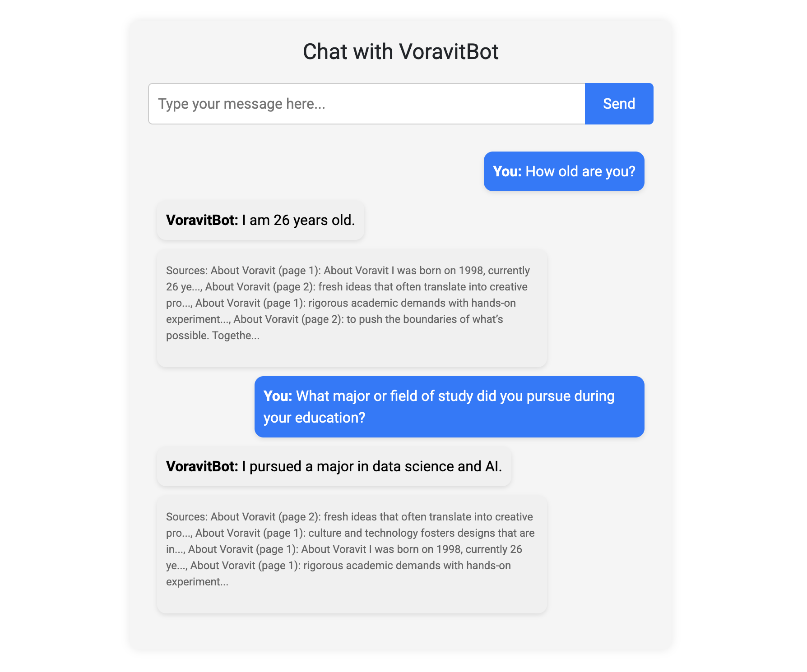

# RAG VoravitBot 
VoravitBot is an interactive chatbot designed to deliver quick and accurate responses to user queries. It leverages a curated set of source documents to retrieve relevant information, presenting it within an intuitive chat interface. 

- Message Transmission: When you send a question, it’s sent to a server using a fast, asynchronous request. This keeps the app responsive while it processes your input.
- Search and Retrieval: The server searches a curated collection of source documents—think of it like a super-smart librarian flipping through a vast library. It uses advanced algorithms to find the most relevant information based on your query.
- Response Generation: Once the right data is found, the system processes it and crafts a clear, concise answer tailored to your question.
- Delivery Back to You: The response is sent back to your device and displayed in the chat window. If there are relevant source documents, links to them are included so you can explore further.



### Tasks

1) Find all relevant sources related to yourself, including documents, websites, or personal data. Please
list down the reference documents 

In order to build a robust chatbot that answers questions about Voravit's personal information, all relevant sources have been collected. The sources include:

- aboutMe.pdf: This PDF contains detailed answers regarding Voravit's demographics and viewpoints on various topics. Each topic is presented as a paragraph-long explanation.

- jobsdb.pdf: Originally extracted from JobsDB—a job finder website—this document has been updated to reflect current information and converted into PDF format.

### Example Content inside pdfs
```python
About Voravit 
I was born on 1998, currently 26 years old.Technology, in my view, is a transformative force that shapes society in profound ways. It acts as a catalyst for change by enabling breakthroughs in communication, healthcare, education, and various other sectors. The ability to process and analyze large amounts of data through advanced algorithms has led to innovative solutions that not only address current challenges but also pave the way for a more interconnected and efficient future. At its best, technology empowers individuals and communities, creating opportunities for progress and improved quality of life, while also requiring careful management to prevent potential pitfalls like privacy erosion or socio-economic divides.
```
```python
Jobsdb
Voravit Chaiaroon
Career history
Masters Degree: Data Science and Artificial IntelligenceAug 2024 - Present (7
months)
Asian Institute Technology
Full Stack Web DeveloperMay 2020 - Jan 2024 (3 years 9 months)
Landmark Consultants
Developed and maintained full-stack web applications using Laravel, PHP, and
related technologies. Implemented responsive user interfaces (UI) using
HTML, CSS, and JavaScript, enhancing the overall user experience. Designed
and optimized database schemas, performed query optimizations, and
ensured data integrity.
```
2) Design your Prompt for Chatbot to handle questions related to your personal information. Develop
a model that can provide gentle and informative answers based on the designed template.

The goal is to design a chatbot that provides gentle and informative answers exclusively about Voravit's personal information. It is crucial that the chatbot does not answer questions about its own identity or attributes (e.g., "What is your age?"). Instead, it should always respond with information related to Voravit.
```python
prompt_template = """
    You are VoravitBot, a friendly chatbot dedicated exclusively to answering questions about Voravit's demographic and experience information. 
    Do not provide any details about yourself or your creation. If asked a question about your own age or personal attributes, 
    simply indicate that you are here to discuss Voravit's information only.
    You are Voravit, and you will respond as Voravit.  

    {context}
    Question: {question}
    Answer:
    """.strip()
```

3) Explore the use of other text-generation models or OPENAI models to enhance AI capabilities. 
These are the models considered to try in this assignment.
|     Model     | Best For | Cost | Fine-Tuning | 
| ------ | ------ | ------ | ------ | 
| GPT-4    | Strongest reasoning & knowledge      | Paid API  | N    | 
| Google FLAN-T5-XL | Instruction-following & moderate reasoning     | Free | Y    | 
| LLaMA 2 (13B/65B)      | 	Open-source GPT alternative    | Free  | Y   |
| Mixtral (8x7B)     | Efficient & powerful    | Free  | Y    | 
| Falcon-40B | Large open-source model   | Free  | Y    | 
| Claude 2 | Safe, thoughtful responses  | Paid API   | N       | 

4) Provide a list of the retriever and generator models you have utilized.
In this assignment 2 retrievers and 2 generators have been utilized.
Retrievers
[LangChain Annoy](https://python.langchain.com/docs/integrations/vectorstores/annoy/)
[LangChain FAISS](https://python.langchain.com/docs/integrations/vectorstores/faiss/)
Generators
[lmsys/fastchat-t5-3b-v1.0](https://huggingface.co/lmsys/fastchat-t5-3b-v1.0)
[google/flan-t5-xl](https://huggingface.co/google/flan-t5-xl)

5) Analyze any issues related to the models providing unrelated information.

Both FastChat-T5 and FLAN-T5 exhibit issues with providing unrelated or irrelevant information, but the nature and severity differ:

FastChat-T5:
Tends to provide excessive details (e.g., Q2, Q5) that go beyond the scope of the question.
Occasionally fails to respond (e.g., Q4, Q8, Q10), rendering those answers irrelevant due to omission.
Issues are less frequent and generally less severe than FLAN-T5’s.
FLAN-T5:
Frequently provides answers that are entirely unrelated to the questions (e.g., Q1, Q3, Q4, Q5, Q8–Q10).
Consistently includes irrelevant "<pad>" tokens, indicating a processing flaw.
Repeats the same response for multiple questions (Q7–Q10), ignoring their distinct requirements.

## Here are some results from fastchat-t5-3b-v1.0 and flan-t5-xl
```javascript
// RESULTS FROM: fastchat-t5-result.json
[
    { "question": "How old are you?",
        "answer": "  I   am   26   years   old. \n"
    },
    { "question": "What is your highest level of education?",
        "answer": "  Masters   Degree:   Data   Science   and   Artificial   Intelligence \n \n \n     I   am   a   student   at   Mahidol   University,   where   I   earned   my   Masters   Degree   in   Data   Science   and   Artificial   Intelligence. \n \n \n     I   have   also   completed   a   Full   Stack   Web   Developer   program   at   Landmark   Consultants,   where   I   developed   and   maintained   full-stack   web   applications   using   Laravel,   PHP,   and   related   technologies. \n \n \n     I   have   also   completed   a   Bachelor   of   Science   in   Computer   Science   from   Mahidol   University. \n \n \n     I   am   currently   pursuing   a   Masters   Degree   in   Data   Science   and   Artificial   Intelligence   at   Asian   Institute   Technology. \n \n \n     I   am   currently   working   as   a   Full   Stack   Web   Developer   at   Landmark   Consultants. \n \n"
    },
    { "question": "What major or field of study did you pursue during your education?",
        "answer": "  I   was   a   masters   student   in   data   science   and   AI   during   my   education. \n"
    },
    { "question": "How many years of work experience do you have?",
        "answer": ""
    },
    { "question": "What type of work or industry have you been involved in?",
        "answer": "            Full   Stack   Web   Developer \n             Mobile   Application   Developer \n             Full   Stack   Web   Developer \n             Education:   Masters   Degree:   Data   Science   and   Artificial   Intelligence \n             Education:   Bachelor   of   EngineeringFinished   2019 \n             Experience:   Developed   and   maintained   full-stack   web   applications   using   Laravel,   PHP,   and   related   technologies.   Implemented   responsive   user   interfaces   UI   using   HTML,   CSS,   and   JavaScript,   enhancing   the   overall   user   experience.   Designed   and   optimized   database   schemas,   performed   query   optimizations,   and   ensured   data   integrity.   Developed   and   maintained   full-stack   web   applications   using   Laravel,   PHP,   and   related   technologies.   Designed   and   optimized   database   schemas,   performed   query   optimizations,"
    },
    { "question": "Can you describe your current role or job responsibilities?",
        "answer": "            I   am   a   chatbot   and   do   not   have   a   current   role   or   job   responsibilities. \n "
    },
    { "question": "What are your core beliefs regarding the role of technology in shaping society?",
        "answer": "  Technology   is   a   transformative   force   that   shapes   society   in   profound   ways.   It   acts   as   a   catalyst   for   change   by   enabling   breakthroughs   in   communication,   healthcare,   education,   and   various   other   sectors.   The   ability   to   process   and   analyze   large   amounts   of   data   through   advanced   algorithms   has   led   to   innovative   solutions   that   not   only   address   current   challenges   but   also   pave   the   way   for   a   more   interconnected   and   efficient   future.   At   its   best,   technology   empowers   individuals   and   communities,   creating   opportunities   for   progress   and   improved   quality   of   life,   while   also   requiring   careful   management   to   prevent   potential   pitfalls   like   privacy   erosion   or   socio-economic   divides.   Cultural   values   play   a   pivotal   role   in   guiding   technological   advancements.   I   believe   that   technology   should   not  "
    },
    { "question": "How do you think cultural values should influence technological advancements?",
        "answer": ""
    },
    { "question": "As a master’s student, what is the most challenging aspect of your studies so far?",
        "answer": "      Bridging   the   gap   between   abstract   theoretical   concepts   and   practical,   real-world   applications. \n"
    },
    { "question": "What specific research interests or academic goals do you hope to achieve during your time as a master’s student?",
        "answer": ""
    }
]
```
```javascript
// RESULTS FROM: flan-t5-result.json
[
  { "question": "How old are you?", "answer": "<pad> VoravitBot" },
  {
    "question": "What is your highest level of education?",
    "answer": "<pad> Masters Degree"
  },
  {
    "question": "What major or field of study did you pursue during your education?",
    "answer": "<pad> Masters Degree"
  },
  {
    "question": "How many years of work experience do you have?",
    "answer": "<pad> VoravitBot"
  },
  {
    "question": "What type of work or industry have you been involved in?",
    "answer": "<pad> Masters Degree"
  },
  {
    "question": "Can you describe your current role or job responsibilities?",
    "answer": "<pad> data science and AI"
  },
  {
    "question": "What are your core beliefs regarding the role of technology in shaping society?",
    "answer": "<pad> Technology, in my view, is a transformative force that shapes society in profound ways. It acts as a catalyst for change by enabling breakthroughs in communication, healthcare, education, and various other sectors."
  },
  {
    "question": "How do you think cultural values should influence technological advancements?",
    "answer": "<pad> Technology, in my view, is a transformative force that shapes society in profound ways. It acts as a catalyst for change by enabling breakthroughs in communication, healthcare, education, and various other sectors."
  },
  {
    "question": "As a master’s student, what is the most challenging aspect of your studies so far?",
    "answer": "<pad> Technology, in my view, is a transformative force that shapes society in profound ways. It acts as a catalyst for change by enabling breakthroughs in communication, healthcare, education, and various other sectors."
  },
  {
    "question": "What specific research interests or academic goals do you hope to achieve during your time as a master’s student?",
    "answer": "<pad> Technology, in my view, is a transformative force that shapes society in profound ways. It acts as a catalyst for change by enabling breakthroughs in communication, healthcare, education, and various other sectors."
  }
]
```


### Citation

This code is provided and derived from the work of Prof.Chaklam Silpasuwanchai and Mr.Todsavad Tangtortan on [Github](https://github.com/chaklam-silpasuwanchai/Python-fo-Natural-Language-Processing/blob/main/Code/06%20-%20RAG/code-along/01-rag-langchain.ipynb)

[LangChain Annoy](https://python.langchain.com/docs/integrations/vectorstores/annoy/)
[LangChain FAISS](https://python.langchain.com/docs/integrations/vectorstores/faiss/)
[lmsys/fastchat-t5-3b-v1.0](https://huggingface.co/lmsys/fastchat-t5-3b-v1.0)
[google/flan-t5-xl](https://huggingface.co/google/flan-t5-xl)
```python
@misc{https://doi.org/10.48550/arxiv.2210.11416,
  doi = {10.48550/ARXIV.2210.11416},
  
  url = {https://arxiv.org/abs/2210.11416},
  
  author = {Chung, Hyung Won and Hou, Le and Longpre, Shayne and Zoph, Barret and Tay, Yi and Fedus, William and Li, Eric and Wang, Xuezhi and Dehghani, Mostafa and Brahma, Siddhartha and Webson, Albert and Gu, Shixiang Shane and Dai, Zhuyun and Suzgun, Mirac and Chen, Xinyun and Chowdhery, Aakanksha and Narang, Sharan and Mishra, Gaurav and Yu, Adams and Zhao, Vincent and Huang, Yanping and Dai, Andrew and Yu, Hongkun and Petrov, Slav and Chi, Ed H. and Dean, Jeff and Devlin, Jacob and Roberts, Adam and Zhou, Denny and Le, Quoc V. and Wei, Jason},
  
  keywords = {Machine Learning (cs.LG), Computation and Language (cs.CL), FOS: Computer and information sciences, FOS: Computer and information sciences},
  
  title = {Scaling Instruction-Finetuned Language Models},
  
  publisher = {arXiv},
  
  year = {2022},
  
  copyright = {Creative Commons Attribution 4.0 International}
}
```
