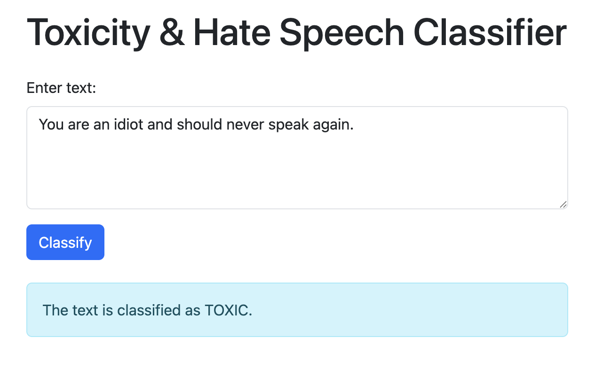
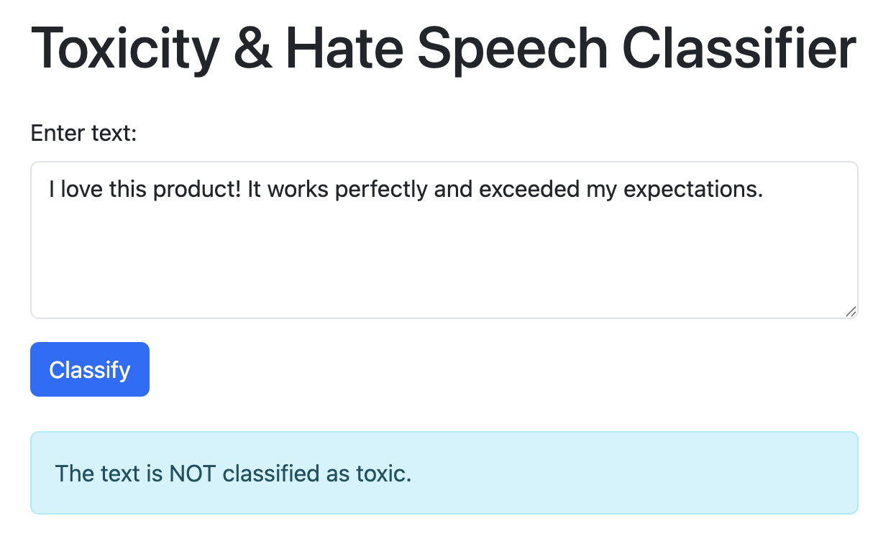

# Toxicity & Hate Speech Classifier Web Application

This web application is a simple Flask-based tool enhanced with Bootstrap that classifies user-input text as toxic or non-toxic. The classifier uses a fine-tuned text classification model to detect toxicity and hate speech.

## Application Features

- Text Input:
  Users can type or paste text into an input box.

- Classification Output:
  Based on the input text, the model classifies it and displays a message indicating whether the text is toxic (e.g., "I hate you" might be classified as toxic) or not, along with a confidence score.

- Source Code and Dependencies:
  The application is built using Python, Flask, and Bootstrap, with model inference powered by the Hugging Face Transformers library.

## App Screenshot

- **Toxic Example**
  
- **Non-Toxic Example**
  

## Overview of the "Measuring Hate Speech" Dataset

The "Measuring Hate Speech" dataset, hosted on Hugging Face at [https://huggingface.co/datasets/ucberkeley-dlab/measuring-hate-speech], is a comprehensive resource developed by UC Berkeley's D-Lab for studying hate speech in social media.  
It stands out for its nuanced approach to hate speech measurement, combining continuous scores with detailed annotations.

The dataset comprises 39,565 unique social media comments **(sourced from platforms like YouTube, Reddit, and Twitter)** annotated by 7,912 crowd-sourced annotators, resulting in **135,556 rows** of annotations. Each comment is evaluated across 10 ordinal survey items—sentiment, respect/disrespect, insult, humiliation, inferior status, violence, dehumanization, genocide, attack/defense, and a hate speech benchmark—yielding a total of 1,355,560 individual labels. A key feature is the hate_speech_score, a continuous measure of hatefulness derived from these annotations using Rasch measurement theory, where **higher scores indicate more hateful content** (e.g., >0.5 approximates hate speech, < -1 indicates counterspeech, and -1 to 0.5 is neutral or ambiguous).

## Bert Parent Model Architecture

This section describes the architecture of the `BertForSequenceClassification` model used in this project. The model is based on the BERT (Bidirectional Encoder Representations from Transformers) architecture, fine-tuned for sequence classification tasks.

### Model Components

### 1. **BertModel**

- The core BERT model consists of embeddings, an encoder, and a pooler.

#### **Embeddings (`BertEmbeddings`)**

- **Word Embeddings**: Maps input token IDs to dense vectors of size 768 (`Embedding(30522, 768)`).
- **Position Embeddings**: Encodes the position of each token in the sequence (`Embedding(512, 768)`).
- **Token Type Embeddings**: Used for tasks like sentence pair classification (e.g., NLI) to distinguish between two sentences (`Embedding(2, 768)`).
- **Layer Normalization**: Normalizes embeddings for stable training (`LayerNorm((768,), eps=1e-12)`).
- **Dropout**: Applies dropout with a probability of 0.1 to prevent overfitting.

#### **Encoder (`BertEncoder`)**

- The encoder consists of 12 transformer layers (`BertLayer`), each with:
  - **Self-Attention Mechanism (`BertAttention`)**:
    - **Query, Key, Value**: Linear transformations for computing attention scores (`Linear(in_features=768, out_features=768)`).
    - **Dropout**: Applied to attention weights.
    - **Output**: Combines attention outputs with a dense layer, layer normalization, and dropout.
  - **Intermediate Layer (`BertIntermediate`)**:
    - Expands the hidden dimension from 768 to 3072 using a dense layer and applies GELU activation.
  - **Output Layer (`BertOutput`)**:
    - Reduces the hidden dimension back to 768 using a dense layer, followed by layer normalization and dropout.

#### **Pooler (`BertPooler`)**

- Extracts a fixed-size representation of the input sequence:
  - **Dense Layer**: Projects the hidden state of the first token (`[CLS]`) to a 768-dimensional vector.
  - **Activation**: Applies a `Tanh` activation function.

### 2. **Dropout**

- Applies dropout with a probability of 0.1 to the pooled output.

### 3. **Classifier**

- A linear layer (`Linear(in_features=768, out_features=2)`) maps the pooled output to logits for binary classification.

```python
BertForSequenceClassification(
  (bert): BertModel(
    (embeddings): BertEmbeddings(
      (word_embeddings): Embedding(30522, 768, padding_idx=0)
      (position_embeddings): Embedding(512, 768)
      (token_type_embeddings): Embedding(2, 768)
      (LayerNorm): LayerNorm((768,), eps=1e-12, elementwise_affine=True)
      (dropout): Dropout(p=0.1, inplace=False)
    )
    (encoder): BertEncoder(
      (layer): ModuleList(
        (0-11): 12 x BertLayer(
          (attention): BertAttention(
            (self): BertSdpaSelfAttention(
              (query): Linear(in_features=768, out_features=768, bias=True)
              (key): Linear(in_features=768, out_features=768, bias=True)
              (value): Linear(in_features=768, out_features=768, bias=True)
              (dropout): Dropout(p=0.1, inplace=False)
            )
            (output): BertSelfOutput(
              (dense): Linear(in_features=768, out_features=768, bias=True)
              (LayerNorm): LayerNorm((768,), eps=1e-12, elementwise_affine=True)
              (dropout): Dropout(p=0.1, inplace=False)
            )
          )
          (intermediate): BertIntermediate(
            (dense): Linear(in_features=768, out_features=3072, bias=True)
            (intermediate_act_fn): GELUActivation()
          )
          (output): BertOutput(
            (dense): Linear(in_features=3072, out_features=768, bias=True)
            (LayerNorm): LayerNorm((768,), eps=1e-12, elementwise_affine=True)
            (dropout): Dropout(p=0.1, inplace=False)
          )
        )
      )
    )
    (pooler): BertPooler(
      (dense): Linear(in_features=768, out_features=768, bias=True)
      (activation): Tanh()
    )
  )
  (dropout): Dropout(p=0.1, inplace=False)
  (classifier): Linear(in_features=768, out_features=2, bias=True)
)
```

## Model Architectures Derived from the Parent Model

This document outlines the different architectures derived from a 12-layer teacher model, explaining the derivation process for each variant:

### 1. Odd an Even Model Architecture

- The **Odd Model** is created by distilling the teacher model’s odd-numbered layers[0, 2, 4, 6, 8, 10].
- The **Even Model** is constructed by using the teacher model’s even-numbered layers[1, 3, 5, 7, 9, 11].
- **Key Characteristics:**
  - **Weight Transfer:** The corresponding weights are transferred to the 6-layer student model, creating an architecture that leverages a different subset of the teacher’s internal representations.
  - **Intended Outcome:** This approach is designed to capture different patterns or features present in the teacher model, which may complement or differ from those learned by the odd model.

### 2. LoRA Model Architecture

- **Derivation Process:**  
  The **LoRA (Low-Rank Adaptation) Model** is derived by fine-tuning the entire teacher (or student) model using LoRA. Instead of copying specific 12 layers, LoRA injects trainable low-rank adaptation matrices into the pre-existing layers.
- **Key Characteristics:**
  - **Parameter Efficiency:** LoRA focuses on adding a small number of trainable parameters (low-rank matrices) to the frozen pre-trained model weights, allowing for efficient adaptation with minimal overhead.
  - **Flexibility:** This method enables the model to adapt to a specific domain or task without modifying the original weights extensively.
  - **Intended Outcome:** The LoRA model maintains the robustness of the parent model while providing flexibility in fine-tuning. It is particularly useful for rapid adaptation with reduced computational costs.

### Summary

- **Odd Model:** Distills knowledge from the odd-numbered layers of the teacher, capturing a subset of its representational power.
- **Even Model:** Utilizes the even-numbered layers, offering an alternative perspective on the teacher’s knowledge.
- **LoRA Model:** Adapts the parent model through low-rank modifications, optimizing for efficiency and flexibility in fine-tuning.

These methods highlight different strategies for reducing model complexity while attempting to preserve or adapt the performance of the original, larger teacher model.

## Model Evaluation and Performance Analysis

### Evaluation Methodology

We evaluated three distinct training methods on a held-out test set:

| Model Type | Best Test Accuracy | Epoch | Training Loss | Loss_cls | Loss_div | Loss_cos |
| ---------- | ------------------ | ----- | ------------- | -------- | -------- | -------- |
| Odd Layer  | 96.6%              | 5     | 0.1548        | 0.3030   | 0.1398   | 0.0217   |
| Even Layer | 96.6%              | 5     | 0.1548        | 0.3030   | 0.1398   | 0.0217   |
| LoRA       | 46.7%              | 5     | 0.2336        | 0.7009   | 0.0000   | 0.0000   |

1. Distillation using Odd Layers:  
   We trained a student model by copying weights from the teacher’s odd-numbered layers (1, 3, 5, 7, 9, 11).
2. Distillation using Even Layers:  
   Another student model was trained by extracting weights from the teacher’s even-numbered layers (2, 4, 6, 8, 10, 12).
3. LoRA Fine-Tuning:  
   A separate student model was fine-tuned using LoRA (Low-Rank Adaptation) to efficiently adapt the teacher model with fewer trainable parameters.

### Performance Analysis

- **Differences Across Methods:**

- **Odd vs. Even Layers:**
  The models trained with odd or even layer distillation showed similar trends in performance with equally Test Accuracy of 96.6%.  
  **Odd Layers Model** may capture certain high-level features and linguistic patterns if those odd-numbered layers carry richer semantic representations  
  **Even Layers Model** might provides an alternative perspective on the teacher’s learned representations, potentially capturing features that the odd layers might overlook.

- **LoRA Fine-Tuning:**
  The LoRA-based approach performed a lot worse compared to the other distilled models withTest Accuracy of 46.7%.  
  This plateau indicates that either the learning rate, the number of epochs, or the adapter configuration needs adjustment.  
  With sufficient training and hyperparameter tuning, LoRA has the potential to match or even outperform the distilled models, but its performance is sensitive to the chosen settings.

## Implementation Challenges & Proposed Improvements

### Challenges Encountered

1. **Distillation Fine-Tuning (Odd and Even Layers)**

- Complex Weight Mapping  
  Ensuring the correct mapping of teacher layers to the student model was challenging, particularly managing off-by-one errors and aligning parameters correctly.
- Limited Adaptation  
  The distilled student models sometimes struggled to capture certain subtle language nuances present in the teacher, leading to marginally lower performance on some test cases.

2. **LoRA Fine-Tuning**

- Adapter Placement  
  Determining the optimal placement of LoRA adapters within the network layers required extensive experimentation.
- Hyperparameter Sensitivity  
  Performance was highly sensitive to hyperparameters such as the low-rank dimension (r) and the scaling factor (lora_alpha), necessitating careful tuning.

### Proposed Improvements

1. **For Distillation Approaches**

- Enhanced Weight Mapping  
  Develop automated tools to verify layer alignment and weight transfer integrity.
- Hybrid Methods  
  Consider combining both odd and even distilled models or integrating additional fine-tuning on top of the distilled model to capture missing nuances.

2. **For LoRA Fine-Tuning**

- Hyperparameter Optimization  
  Employ automated hyperparameter search techniques (e.g., Bayesian optimization) to identify optimal LoRA configurations.
- Layer-wise Adaptation  
  Experiment with selectively applying LoRA adapters to different layers rather than uniformly, based on the importance of each layer in capturing toxic language features.

### Citation

This code is provided and derived from the work of Prof.Chaklam Silpasuwanchai and Mr.Todsavad Tangtortan on [Github DistilBERT](https://github.com/chaklam-silpasuwanchai/Python-fo-Natural-Language-Processing/blob/main/Code/04%20-%20Huggingface/Appendix%20-%20Efficient%20Network%20Training/01-distilation/distilBERT.ipynb)  
[Github Peft LoRA](https://github.com/chaklam-silpasuwanchai/Python-fo-Natural-Language-Processing/blob/main/Code/04%20-%20Huggingface/Appendix%20-%20Efficient%20Network%20Training/03-peft/PEFT_from_hf.ipynb)  
[ucberkeley Dataset](https://huggingface.co/datasets/ucberkeley-dlab/measuring-hate-speech)

```python
#Dataset
@article{kennedy2020constructing,
  title={Constructing interval variables via faceted Rasch measurement and multitask deep learning: a hate speech application},
  author={Kennedy, Chris J and Bacon, Geoff and Sahn, Alexander and von Vacano, Claudia},
  journal={arXiv preprint arXiv:2009.10277},
  year={2020}
}
```
